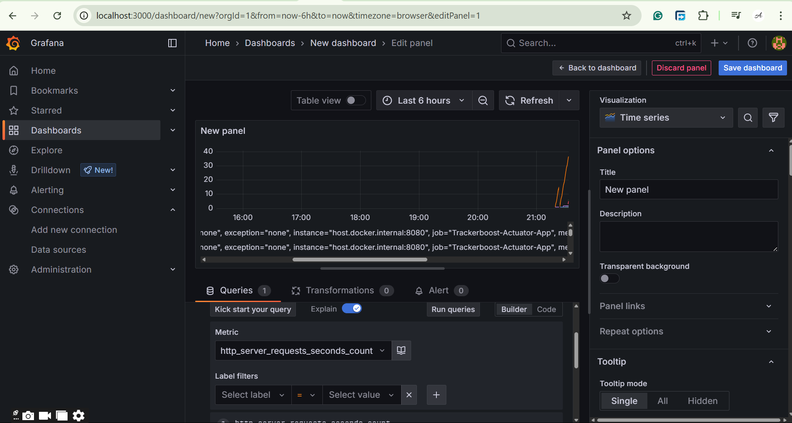

[//]: # (![challenge banner](image/amaliTechLab.webp))

# Advanced Lab3: Securing Project Tracker API


This lab is part of an internal audit to **enhance the performance** of the _Project Tracker_ system.  
The goal is to identify and fix performance bottlenecks, improve resource usage, and add real-time observability.

## 🎥 Video
* Final Project: Not Available for now!
  
## 🧩 Diagram

<div style="display: flex; gap: 20px;">
  <div style="flex: 1;">
    <p>Component diagram: <a href="https://drive.google.com/file/d/1_ltTqN6KSubbTDNp-c-W7sVSpbAdLDPH/view?usp=sharing">Available here</a></p>
    
  </div>
  <div style="flex: 1;">
    <p>ERD: <a href="https://drive.google.com/file/d/1yx91iDzRJZj91rGV1AZgFM__RQeRkDOn/view?usp=sharing">Available here</a></p>
    
  </div>
</div>

  
## 🛠 Usage
* Backend codes: Logic behind (MVC Architecture)
    - controller handle http request and response
    - dao is where collection methods or functionalities are implemented
    - model holds project classes
    - service has the business logic
    - config create a singleton object for the collection.
    - exception handle custom exceptions
* Interactions between components:
    - Client ↔ Controller: HTTP requests and responses
    - Controller → Service: Invokes business logic methods
    - Service → Repository: Queries or updates data
    - Repository → Database: Executes SQL queries
    - Client ↔ Postman: View and test API endpoints

## ⚙ **How to Run**

1. Clone the repository:
   ```bash
   git clone https://github.com/karangwaajika/tracker-boost.git
   cd tracker-boost
2. Start services with Docker Compose:
   ```bash
   docker compose up -d  
3. Run the application:
   ```bash
   ./mvnw spring-boot:run  
4. Access the following:
     - Actuator metrics: `http://localhost:8080/actuator/metrics`
     - Grafana dashboard: `http://localhost:3000`

## 🧪 Profiling & Testing

- Use **JMeter** to simulate load and observe response times
- Use **JProfiler** to capture heap dumps and monitor memory usage
- Review logs and metrics in real-time via **Actuator** and **Grafana**

## 📸 Screenshots JMeter and Grafana

<div style="display: flex; gap: 10px;">
  
  
</div>

## 📌 Key Improvements

- Better **memory management** and lower GC pause times
- Reduced API response times through **DTO projections**
- Caching frequently accessed data with **Redis**
- Observability via **Spring Boot Actuator**, **Prometheus**, and **Grafana**

## 🧩 Project Structure

- `src/main/java` – Core application code (services, controllers, DTOs)
- `src/main/resources` – Config files (`application.yml`)
- `docker-compose.yml` – Docker services (Redis, PostgreSQL, MongoDB, Prometheus, Grafana)
- `README.md` – Project documentation

## 📊 **Tools & Technologies**

- Java & Spring Boot
- JMeter
- JProfiler
- Spring Boot Actuator
- ModelMapper / MapStruct (for DTO mapping)
- Redis (for caching)
- PostgreSQL / MongoDB (data stores)
- Docker (for local development & orchestration)

## Swagger / OpenAPI end points.
*  /api/auth/**               →  “auth”       (login and registration)
*  /auth/oauth2/**            →  “auth”       (OAuth2 callback & success)
*  /api/users/**              →  “users”      (profile)
*  /api/projects/**           →  “projects”   (create / update / delete)
*  /api/tasks/**              →  “tasks”      (developer task updates)
*  /api/developers/**         →  “developers” (developers crud operations)
*  /api/admin/**              →  “admin”      (admin view users)

## Expected Learning Outcomes

- Master performance profiling of Spring Boot applications
- Interpret GC logs, thread states, and heap statistics
- Apply memory-efficient coding and caching strategies
- Monitor application health and usage metrics in production-ready way
- Deliver measurable API performance improvements
